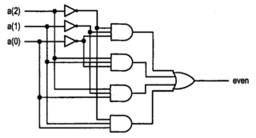
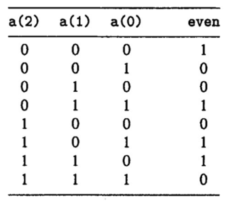

# 2020-1 AV1

| Pontos                 |
| -------                |
|   18                   |

Avaliação 1 de elementos. 

- **Trabalhar sozinho**
- **35 minutos**
- **Ficar conectado no canal geral (para ouvir instruções)**

## Começando

Você deve:

1. clonar o seu repositório (e trabalhar nele)
1. editar o arquivo `ALUNO.json`
1. não esqueça de dar `commit` e `push`

> Todas as questões possuem testes. Vocês devem editar o arquivo `tests/config.txt` para inserir o módulo no teste. A simulação e o teste deve ser executada pelo comando `./testeAVI.py`


## Questões

As questões que possuem código (`.vhd`) devem ser implementadas nos arquivos localizados na pasta `src/rtl` e testadas com o script:

```
./testeAV1.py
```

**LEMBRE DE REALIZAR COMMIT (A CADA QUESTÃO) E DAR PUSH AO FINALIZAR**

### 1 - 6 pts

| Arquivo                | pnts   |
| -------                | ----   |
| `src/rtl/questao1.vhd` | 4 (HW) |
| `rtl.png`              | 2 (HW) |

O circuito a seguir implementa um verificador de paridade de um vetor de 3 bits, onde even = `1` quando a soma dos bits do vetor a (a2,a1,a0) forem par e `0` caso contrário, conforme tabela verdade.




a) (4 HW) Escreva em VHDL uma representação do circuito verificador de paridade (`src/rtl/questao1.vhd`).

b) (2 HW) Gere o RTL do circuito e salve no repositório com o nome: `rtl.png`

### 2 - 12 pts

| Arquivo                | pnts    |
| -------                | ----    |
| `src/rtl/questao2.vhd` | 12 (HW) |
|    - `XeqY` | 4 pts|
|    - `XltY` | 8 pts| 

Você resolveu melhorar a ULA do Z01.1, para isso irá avaliar a ideia em uma versão simplificada que opera apenas com **dois bits de largura**. Sua ideia foi a de adicionar informações que comparam a entrada `X` com a entrada `Y` da ULA, fornecendo os seguintes sinais: `XeqY` (x igual a y) e `XltY` (x menor que y).

> Considere números codificados em complemento de dois.

- `XeqY = 1` quando a entrada X for igual a entrada Y (`X == Y`)
- `XltY = 1` quando a entrada X for menor que a entrada Y (`X < Y`)

O componente a ser criado possui a estrutura a seguir (entity do `questao2.vhd`):

```
 x1,x0 |------------|
  -/-->|            |--> XeqY
       | Comparador | 
 y1,y0 |            |
  -/-->|            |--> XltY
       |------------|
```

Escreva em VHDL o código que implementa o comparador (`src/rtl/questao2.vnd`).

> Dica
>   - Faça a tabela verdade, encontre as equações e implemente em VHDL.
>   - X e Y são entradas de 2 bits cada
>   - Complemento de dois
>   - XeqY e XltY são saídas de 1 bit cada
